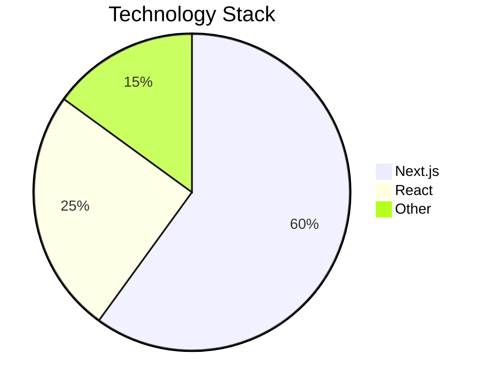

# NoughtRapper 🚀

[](https://opensource.org/licenses/MIT)
[](https://github.com/olujimiAdebakin/noughtrapper/issues)
[](https://github.com/olujimiAdebakin/noughtrapper/stargazers)

``````````````````

Noughtaegis – Cybersecurity & IT Services Dashboard

Noughtaegis is a full-stack web application that provides a secure admin dashboard for managing cybersecurity campaigns, client accounts, quishing simulations, exams, and IT platforms.
It is built with Next.js (App Router), TailwindCSS, NextUI, and integrates authentication, RBAC navigation, and API routes for secure client/server communication.
Infrastructure is provisioned via Terraform and deployed with GitHub Actions.


`````````````````````

## 📊 Project Overview

```````````````````

🚀 Features

Role-Based Navigation

superAdminLinks → Manage campaigns, clients, exams, platforms, quishing.

adminLinks → Dashboard + user management.

Authentication

Middleware protects all sensitive routes (/admin-dashboard, /campaigns, /platform, etc.).

Cookie-based session (authToken).

Redirect handling via previousPath.

Login, 2FA, forgot password, and reset password flows.

Modules

Campaigns → Awareness campaigns with detailed stats.

Exams → Create, preview, and publish cybersecurity exams.

Manage Clients → Client onboarding, details, documents, staff, training.

Platforms → Add/edit platforms, manage templates, logs, usage stats.

Quishing → QR phishing simulations with dashboards for camera, location, voice.

Account Info & Settings → Profile, security, team settings.

Frontend Stack

Next.js (App Router)

TailwindCSS

NextUI

React Query

React Hot Toast

Infrastructure & Deployment

Terraform modules for Amplify, S3, CloudFront.

CI/CD with GitHub Actions (.github/workflows/deploy.yaml).

Configured for AWS hosting with CDN + storage.

`````````````

📂 Directory Structure


olujimiadebakin-noughtrapper/
├── src/
│   ├── app/              # Next.js App Router pages
│   ├── components/       # UI components (navigation, forms, reusable widgets)
│   ├── providers/        # Context + NextUI setup
│   ├── middleware.js     # Auth middleware
│   ├── links.js          # Role-based navigation configs
│   └── api/              # API routes (auth, account, clients, exams, etc.)
├── terraform/            # Infrastructure as code (Amplify, S3, CloudFront)
├── .github/workflows/    # CI/CD pipeline
├── amplify.yml           # AWS Amplify build config
├── package.json
├── next.config.mjs
└── tailwind.config.mjs

```````````




flowchart TD
    A[User Request] --> B{Login Path?}
    B -- Yes --> C{Has Token?}
    C -- Yes --> D[Redirect to previousPath or /admin-dashboard]
    C -- No --> E[Allow access to login page]
    B -- No --> F{Protected Route?}
    F -- Yes --> G{Has Token?}
    G -- No --> H[Redirect to /login with callbackUrl]
    G -- Yes --> I[Store previousPath in cookie]
    F -- No --> J[Allow Access]


## 🚀 Getting Started

### Prerequisites

Before you begin, ensure you have installed:
- Node.js (Latest LTS version recommended)
- npm, yarn, pnpm, or bun

### Installation

1. Clone the repository:
```bash
git clone https://github.com/olujimiAdebakin/noughtrapper.git
cd noughtrapper
```


🛠️ Infrastructure & Deployment

Terraform

terraform/module/s3 → Manages static storage.

terraform/module/cloudfront → CDN & caching.

terraform/module/amplify → Amplify hosting configs.

CI/CD

GitHub Actions workflow (deploy.yaml) handles build & deploy.

Amplify build pipeline defined in amplify.yml.

## 📚 Learn More

Explore these resources to learn more about the technologies used:

- [Next.js Documentation](https://nextjs.org/docs) - Learn about Next.js features
- [Learn Next.js](https://nextjs.org/learn) - Interactive Next.js tutorial
- [Next.js GitHub Repository](https://github.com/vercel/next.js)

## 🚀 Deployment

Deploy easily using [Vercel](https://vercel.com/new?utm_medium=default-template&filter=next.js&utm_source=create-next-app&utm_campaign=create-next-app-readme), the platform from the creators of Next.js.

For more deployment options, check the [Next.js deployment documentation](https://nextjs.org/docs/app/building-your-application/deploying).

## 🤝 Contributing

Contributions are welcome! Please feel free to submit a Pull Request.

1. Fork the Project
2. Create your Feature Branch (`git checkout -b feature/AmazingFeature`)
3. Commit your Changes (`git commit -m 'Add some AmazingFeature'`)
4. Push to the Branch (`git push origin feature/AmazingFeature`)
5. Open a Pull Request

## 📝 License

This project is licensed under the MIT License.

---

<div align="center">
Made with ❤️ by <a href="https://github.com/olujimiAdebakin">Olujimi Adebakin</a>
</div>
