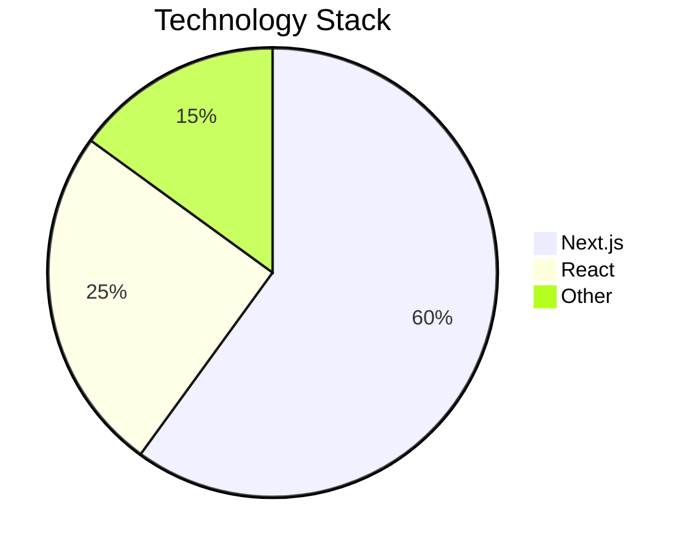

# NoughtRapper 🚀

[](https://opensource.org/licenses/MIT)
[](https://github.com/olujimiAdebakin/noughtrapper/issues)
[](https://github.com/olujimiAdebakin/noughtrapper/stargazers)

A modern Next.js project built for performance and scalability, bootstrapped with [`create-next-app`](https://github.com/vercel/next.js/tree/canary/packages/create-next-app).

## 📊 Project Overview



## ✨ Key Features

- 🎯 Built with Next.js 14
- ⚡️ Fast page loads and optimal performance
- 🎨 Geist font integration for modern typography
- 📱 Responsive design for all devices
- 🛠️ Easy development setup

## 🚀 Getting Started

### Prerequisites

Before you begin, ensure you have installed:
- Node.js (Latest LTS version recommended)
- npm, yarn, pnpm, or bun

### Installation

1. Clone the repository:
```bash
git clone https://github.com/olujimiAdebakin/noughtrapper.git
cd noughtrapper
```

2. Install dependencies:
```bash
npm install
# or
yarn install
# or
pnpm install
# or
bun install
```

### Development

Run the development server:
```bash
npm run dev
# or
yarn dev
# or
pnpm dev
# or
bun dev
```

Visit [http://localhost:3000](http://localhost:3000) to view your application.

## 🔧 Project Structure

The project follows Next.js 14 conventions:
- `app/` - Contains all page components and routing
- `public/` - Static assets
- `components/` - Reusable React components
- `styles/` - CSS and styling files

## 📚 Learn More

Explore these resources to learn more about the technologies used:

- [Next.js Documentation](https://nextjs.org/docs) - Learn about Next.js features
- [Learn Next.js](https://nextjs.org/learn) - Interactive Next.js tutorial
- [Next.js GitHub Repository](https://github.com/vercel/next.js)

## 🚀 Deployment

Deploy easily using [Vercel](https://vercel.com/new?utm_medium=default-template&filter=next.js&utm_source=create-next-app&utm_campaign=create-next-app-readme), the platform from the creators of Next.js.

For more deployment options, check the [Next.js deployment documentation](https://nextjs.org/docs/app/building-your-application/deploying).

## 🤝 Contributing

Contributions are welcome! Please feel free to submit a Pull Request.

1. Fork the Project
2. Create your Feature Branch (`git checkout -b feature/AmazingFeature`)
3. Commit your Changes (`git commit -m 'Add some AmazingFeature'`)
4. Push to the Branch (`git push origin feature/AmazingFeature`)
5. Open a Pull Request

## 📝 License

This project is licensed under the MIT License.

---

<div align="center">
Made with ❤️ by <a href="https://github.com/olujimiAdebakin">Olujimi Adebakin</a>
</div>